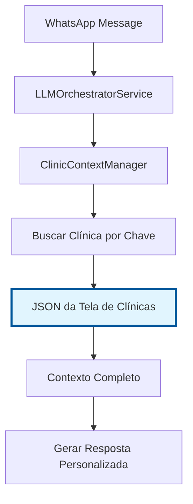

# 🔗 Integração do Sistema de Contextualização JSON

## 📋 Visão Geral

Este documento explica como o **sistema de contextualização JSON da tela de clínicas** foi integrado aos **serviços core** desenvolvidos com o Manus, criando uma solução unificada e robusta.

**🎯 REGRA FUNDAMENTAL:** O sistema usa APENAS os JSONs inseridos na tela de clínicas como fonte de dados. NUNCA assume ou cria JSONs manualmente.

## 🏗️ Arquitetura da Integração

### 1. **ClinicContextManager** (Novo Serviço Core)
- **Localização**: `services/core/clinicContextManager.js`
- **Função**: Gerencia toda a contextualização das clínicas
- **Integração**: Conecta dados do banco com JSONs de contextualização

### 2. **LLMOrchestratorService** (Atualizado)
- **Localização**: `services/core/llmOrchestratorService.js`
- **Função**: Usa o ClinicContextManager para obter contexto
- **Benefício**: Acesso unificado a todos os dados da clínica

### 3. **Sistema JSON da Tela de Clínicas** (ÚNICA FONTE)
- **Localização**: `data/contextualizacao-*.json`
- **Função**: Fornece personalização e configurações específicas inseridas pelo usuário
- **Integração**: Dados usados diretamente pelos serviços core
- **IMPORTANTE**: NUNCA assume ou cria JSONs manualmente

## 🔄 Fluxo de Funcionamento



## 📊 Estrutura dos Dados Integrados

### Dados do Banco (Prioridade Alta)
```javascript
{
  id: "clinic_id",
  name: "Nome da Clínica",
  address: "Endereço",
  phone: "Telefone",
  mainEmail: "Email",
  website: "Website",
  description: "Descrição",
  specialties: ["Especialidades"],
  services: ["Serviços"],
  professionals: ["Profissionais"],
  insurance: ["Convênios"],
  workingHours: { /* Horários básicos */ }
}
```

### Dados do JSON (Prioridade Alta para Personalização)
```javascript
{
  agentConfig: {
    nome: "Dr. Carlos",
    personalidade: "Profissional e acolhedor",
    tom_comunicacao: "Formal mas acessível",
    nivel_formalidade: "Médio-alto",
    saudacao_inicial: "Olá! Sou o Dr. Carlos...",
    mensagem_despedida: "Obrigado por escolher...",
    mensagem_fora_horario: "No momento estamos fora..."
  },
  agentBehavior: {
    proativo: true,
    oferece_sugestoes: true,
    solicita_feedback: true,
    escalacao_automatica: true,
    limite_tentativas: 3,
    contexto_conversa: true
  },
  agentRestrictions: {
    nao_pode_diagnosticar: true,
    nao_pode_prescrever: true,
    emergencias_cardiacas: ["Dor no peito..."]
  },
  detailedWorkingHours: { /* Horários detalhados */ },
  detailedProfessionals: [/* Profissionais detalhados */],
  detailedServices: [/* Serviços detalhados */],
  policies: { /* Políticas e procedimentos */ }
}
```

## 🚀 Como Usar

### 1. **Inicialização Automática**
O ClinicContextManager é inicializado automaticamente quando o servidor inicia:

```javascript
// server.js
const { ClinicContextManager } = await import('./services/core/index.js');
await ClinicContextManager.initialize();
```

### 2. **Uso no LLMOrchestratorService**
```javascript
// Buscar contexto por WhatsApp
const clinicContext = await ClinicContextManager.getClinicContextByWhatsApp(phoneNumber);

// Usar no prompt do sistema
const systemPrompt = this.prepareSystemPrompt(clinicContext, userProfile);
```

### 3. **Acesso Direto**
```javascript
// Obter contexto completo por ID
const context = await ClinicContextManager.getCompleteClinicContext(clinicId);

// Verificar se tem JSON
const hasJson = ClinicContextManager.hasJsonContext(clinicId);

// Obter estatísticas
const stats = ClinicContextManager.getStats();
```

## 🔧 Configuração

### 1. **Estrutura dos JSONs**
Os arquivos devem seguir o padrão: `data/contextualizacao-{clinicId}.json`

### 2. **Campos Obrigatórios**
```json
{
  "clinica": {
    "informacoes_basicas": { /* ... */ },
    "localizacao": { /* ... */ },
    "contatos": { /* ... */ },
    "horario_funcionamento": { /* ... */ }
  },
  "agente_ia": {
    "configuracao": { /* ... */ },
    "comportamento": { /* ... */ },
    "restricoes": { /* ... */ }
  }
}
```

### 3. **Mapeamento WhatsApp**
O sistema mapeia automaticamente números de WhatsApp para clínicas via banco de dados.

## 📈 Benefícios da Integração

### ✅ **Antes (Sistema Separado)**
- Dados espalhados em diferentes fontes
- Lógica duplicada para busca de contexto
- Difícil manutenção e atualização
- Falta de consistência entre fontes

### 🚀 **Depois (Sistema Integrado)**
- **Dados unificados**: APENAS JSONs da tela de clínicas
- **Cache inteligente**: Performance otimizada
- **Fallback robusto**: Sempre funciona, mesmo com erros
- **Manutenção simples**: Um ponto de controle (tela de clínicas)
- **Consistência garantida**: Dados sempre vêm da mesma fonte

## 🧪 Testes

### Script de Teste
Execute o script de teste para validar a integração:

```bash
node test-clinic-context-integration.js
```

### O que é Testado
1. ✅ Inicialização do ClinicContextManager
2. ✅ Carregamento de JSONs
3. ✅ Busca por WhatsApp
4. ✅ Mesclagem de dados
5. ✅ Fallback inteligente
6. ✅ Estatísticas e cache

## 🔍 Monitoramento

### Logs Importantes
- `🏥 [ClinicContextManager]` - Operações do gerenciador
- `📄 [ClinicContextManager]` - Operações com JSONs
- `🔗 [ClinicContextManager]` - Mesclagem de dados
- `🔄 [ClinicContextManager]` - Operações de fallback

### Métricas Disponíveis
```javascript
const stats = ClinicContextManager.getStats();
// {
//   totalClinics: 2,
//   totalJsonContexts: 2,
//   totalWhatsappMappings: 4,
//   cacheSize: 8
// }
```

## 🚨 Troubleshooting

### Problema: JSON não carregado
**Solução**: Verificar se o arquivo existe em `data/contextualizacao-{clinicId}.json`

### Problema: Clínica não encontrada
**Solução**: Verificar se o número de WhatsApp está cadastrado no banco

### Problema: Dados não mesclados
**Solução**: Verificar se o JSON tem a estrutura correta

## 🎯 Próximos Passos

1. **Testar em produção** com mensagens reais do WhatsApp
2. **Otimizar cache** baseado no uso real
3. **Adicionar mais clínicas** com seus respectivos JSONs
4. **Implementar atualizações em tempo real** dos JSONs

## 📞 Suporte

Para dúvidas sobre a integração:
- Verificar logs do servidor
- Executar script de teste
- Consultar este documento
- Verificar estrutura dos JSONs
