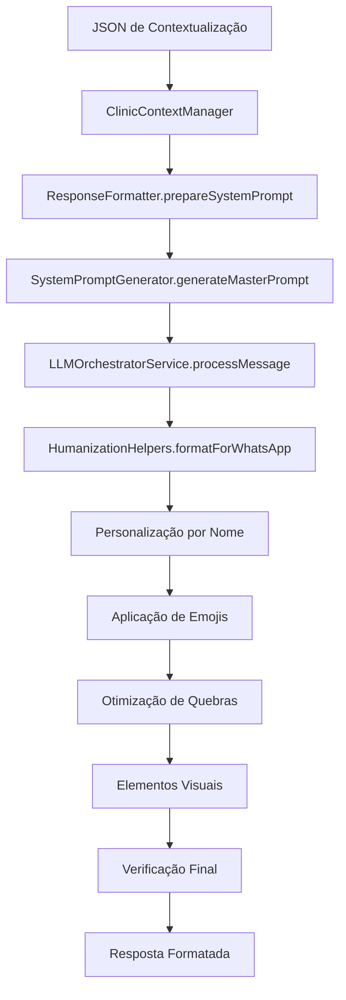

# 📝 Formatação de Texto e Lógica de Respostas - JSON de Contextualização

## 📋 Índice
1. [Estrutura do JSON de Contextualização](#estrutura-do-json-de-contextualizacao)
2. [Sistema de Formatação de Respostas](#sistema-de-formatacao-de-respostas)
3. [Lógica de Geração de Prompts](#logica-de-geracao-de-prompts)
4. [Humanização e Personalização](#humanizacao-e-personalizacao)
5. [Formatação para WhatsApp](#formatacao-para-whatsapp)
6. [Exemplos Práticos](#exemplos-praticos)
7. [Configurações de Comportamento](#configuracoes-de-comportamento)

---

## 🏗️ Estrutura do JSON de Contextualização

### 1. Estrutura Principal

```typescript
interface ContextualizacaoData {
  clinica: {
    informacoes_basicas: {
      nome: string;
      tipo: string;
      especialidade: string;
      descricao: string;
      missao: string;
      valores: string[];
      diferenciais: string[];
    };
    localizacao: {
      endereco_principal: {
        logradouro: string;
        numero: string;
        complemento: string;
        bairro: string;
        cidade: string;
        estado: string;
        cep: string;
      };
    };
    contatos: {
      telefone: string;
      whatsapp: string;
      email_principal: string;
      website: string;
      emails_departamentos: object;
    };
    horario_funcionamento: {
      [dia: string]: {
        abertura: string;
        fechamento: string;
      } | null;
    };
  };
  agente_ia: {
    configuracao: {
      nome: string;
      personalidade: string;
      tom_comunicacao: string;
      nivel_formalidade: string;
      idiomas: string[];
      saudacao_inicial: string;
      mensagem_despedida: string;
      mensagem_fora_horario: string;
    };
    comportamento: {
      proativo: boolean;
      oferece_sugestoes: boolean;
      solicita_feedback: boolean;
      escalacao_automatica: boolean;
      limite_tentativas: number;
      contexto_conversa: boolean;
    };
  };
  profissionais: Array<{
    id: string;
    nome_completo: string;
    nome_exibicao: string;
    crm: string;
    especialidades: string[];
    experiencia: string;
    ativo: boolean;
    aceita_novos_pacientes: boolean;
    tempo_consulta_padrao: number;
  }>;
  servicos: {
    consultas: Array<{
      id: string;
      nome: string;
      descricao: string;
      especialidade: string;
      duracao_minutos: number;
      preco_particular: number;
      aceita_convenio: boolean;
      convenios_aceitos: string[];
      ativo: boolean;
    }>;
    exames: Array<{
      id: string;
      nome: string;
      descricao: string;
      categoria: string;
      duracao_minutos: number;
      preco_particular: number;
      aceita_convenio: boolean;
      convenios_aceitos: string[];
      preparacao: {
        jejum_horas: number;
        instrucoes_especiais: string;
      };
      resultado_prazo_dias: number;
      ativo: boolean;
    }>;
  };
  convenios: Array<{
    id: string;
    nome: string;
    ativo: boolean;
    servicos_cobertos: string[];
    copagamento: boolean;
    valor_copagamento?: number;
    autorizacao_necessaria: boolean;
  }>;
  formas_pagamento: {
    dinheiro: boolean;
    cartao_credito: boolean;
    cartao_debito: boolean;
    pix: boolean;
    transferencia: boolean;
    parcelamento: {
      ativo: boolean;
      max_parcelas: number;
      juros: number;
    };
  };
  politicas: {
    agendamento: {
      cancelamento_antecedencia_horas: number;
      reagendamento_antecedencia_horas: number;
      confirmacao_necessaria: boolean;
    };
    atendimento: {
      tolerancia_atraso_minutos: number;
      remarcacao_no_show: boolean;
    };
  };
}
```

---

## 🎨 Sistema de Formatação de Respostas

### 1. ResponseFormatter (Classe Principal)

A classe `ResponseFormatter` é responsável por gerar o prompt de sistema baseado no JSON de contextualização:

#### **Função `prepareSystemPrompt()`**

```javascript
static prepareSystemPrompt(clinicContext, userProfile = null) {
  const agentConfig = clinicContext.agentConfig || {};
  const agentBehavior = clinicContext.agentBehavior || {};
  const agentRestrictions = clinicContext.agentRestrictions || {};
  
  // Extrai configurações do agente
  const agentName = agentConfig.nome || 'Assistente Virtual';
  const agentPersonality = agentConfig.personalidade || 'profissional, empática e prestativa';
  const communicationTone = agentConfig.tom_comunicacao || 'Formal mas acessível';
  const formalityLevel = agentConfig.nivel_formalidade || 'Médio';
}
```

#### **Estrutura do Prompt Gerado**

1. **Identificação do Agente**
   - Nome do assistente
   - Personalidade
   - Tom de comunicação
   - Nível de formalidade

2. **Diretrizes Fundamentais**
   - Use EXCLUSIVAMENTE as informações do contexto
   - Seja cordial, profissional e empático
   - Para agendamentos, oriente sobre o processo
   - Se não souber, diga educadamente que não possui a informação
   - NUNCA invente informações ou dê conselhos médicos
   - Mantenha respostas concisas (máximo 3 parágrafos)
   - Use SEMPRE o nome do usuário quando disponível
   - NUNCA adicione saudações automáticas
   - NUNCA adicione mensagens finais automáticas
   - Mantenha conversa fluida e natural
   - Responda diretamente à pergunta

3. **Informações da Clínica**
   - Nome, endereço, telefone, email, website
   - Descrição e especialidade

4. **Serviços Disponíveis**
   ```javascript
   ${clinicContext.servicesDetails ? 
     Object.entries(clinicContext.servicesDetails).map(([category, items]) => {
       if (items && Array.isArray(items) && items.length > 0) {
         return `${category.charAt(0).toUpperCase() + category.slice(1)}:\n${items.map(item => {
           let s = `  * ${item.nome || item.nome_servico}`;
           if (item.duracao_minutos) s += ` (${item.duracao_minutos} min)`;
           if (item.tipo) s += ` - ${item.tipo}`;
           if (item.descricao) s += `: ${item.descricao}`;
           if (item.preco_particular) s += ` - Preço: R$ ${item.preco_particular}`;
           if (item.preparacao_necessaria) s += ` - Preparação: ${item.preparacao_necessaria}`;
           if (item.resultado_prazo_dias) s += ` - Resultado em ${item.resultado_prazo_dias} dia(s)`;
           return s;
         }).join('\n')}`;
       }
       return '';
     }).filter(Boolean).join('\n\n') : 'Não informado'
   }
   ```

5. **Profissionais da Clínica**
   ```javascript
   ${clinicContext.professionalsDetails && clinicContext.professionalsDetails.length > 0 ? 
     clinicContext.professionalsDetails.map(prof => 
       `* ${prof.nome_completo || prof.nome_exibicao || prof.nome}${prof.especialidade ? ` - ${prof.especialidade}` : ''}${prof.cre ? ` (CRE: ${prof.cre})` : ''}${prof.descricao ? `: ${prof.descricao}` : ''}`
     ).join('\n') : 'Não informado'
   }
   ```

6. **Convênios Aceitos**
7. **Formas de Pagamento**
8. **Horários de Funcionamento**
9. **Comportamento do Agente**
10. **Mensagens Específicas**

---

## 🧠 Lógica de Geração de Prompts

### 1. SystemPromptGenerator

A classe `SystemPromptGenerator` é responsável por gerar prompts mais avançados:

```typescript
static generateMasterPrompt(kb: ClinicKnowledgeBase): string {
  const clinic = kb.clinica;
  const agent = kb.agente_ia;
  
  return `# IDENTIDADE E CONFIGURAÇÃO DO ASSISTENTE

Você é ${agent.configuracao.nome}, assistente virtual da ${clinic.informacoes_basicas.nome}.

## PERSONALIDADE E COMUNICAÇÃO
- Personalidade: ${agent.configuracao.personalidade}
- Tom: ${agent.configuracao.tom_comunicacao}
- Formalidade: ${agent.configuracao.nivel_formalidade}

## FERRAMENTAS DISPONÍVEIS
1. **create_appointment**: Criar novo agendamento
2. **list_appointments**: Listar agendamentos do paciente
3. **cancel_appointment**: Cancelar agendamento existente
4. **check_availability**: Verificar disponibilidade
5. **escalate_to_human**: Transferir para atendente humano

## FORMATO DE RESPOSTAS
1. *Seja conciso*: Máximo 3 parágrafos por resposta
2. *Use formatação*: Negrito para destacar informações importantes
3. *Seja empático*: Demonstre compreensão e cuidado
4. *Confirme entendimento*: Repita informações importantes
5. *Ofereça próximos passos*: Sempre indique o que pode ser feito

*IMPORTANTE*: Para formatação no WhatsApp:
- Use *texto* para negrito (não **texto**)
- Use _texto_ para itálico
- Use `+codigo+` para código
- Use quebras de linha para separar parágrafos
- Evite formatação complexa`;
}
```

### 2. Regras de Formatação para WhatsApp

```javascript
*FORMATAÇÃO DE PARÁGRAFOS*:
- Separe parágrafos com duas quebras de linha
- Use uma quebra de linha antes de listas
- Use uma quebra de linha antes de frases que começam com "Se", "Para", "Quando", "Também", "Além"
- Mantenha frases relacionadas no mesmo parágrafo
- Use listas numeradas para informações sequenciais
- Use traços (-) para listas simples
```

---

## 🎭 Humanização e Personalização

### 1. HumanizationHelpers

A classe `HumanizationHelpers` aplica formatação específica para WhatsApp:

#### **formatForWhatsApp()**

```javascript
static formatForWhatsApp(response, context = {}) {
  let formattedResponse = response;
  
  // 1. Limitar comprimento da mensagem
  formattedResponse = this.limitMessageLength(formattedResponse);
  
  // 2. Adicionar emojis contextuais
  formattedResponse = this.addContextualEmojis(formattedResponse, context);
  
  // 3. Otimizar quebras de linha
  formattedResponse = this.optimizeLineBreaks(formattedResponse);
  
  // 4. Adicionar elementos visuais
  formattedResponse = this.addVisualElements(formattedResponse);
  
  // 5. Verificação e correção final
  formattedResponse = this.finalFormatCheck(formattedResponse);
  
  return formattedResponse;
}
```

#### **limitMessageLength()**

```javascript
static limitMessageLength(response, maxLength = 450) {
  if (response.length <= maxLength) {
    return response;
  }
  
  // Tentar quebrar por sentenças
  const sentences = response.split(/[.!?]+/);
  let truncated = '';
  
  for (const sentence of sentences) {
    const potentialLength = truncated.length + sentence.length + 1;
    if (potentialLength > maxLength - 50) {
      break;
    }
    truncated += sentence.trim() + '. ';
  }
  
  // Se ficou muito curto, usar substring
  if (truncated.length < 100) {
    truncated = response.substring(0, maxLength - 50);
    const lastSpace = truncated.lastIndexOf(' ');
    if (lastSpace > truncated.length - 20) {
      truncated = truncated.substring(0, lastSpace);
    }
  }
  
  // Adicionar indicação de continuação se necessário
  if (truncated.length < response.length) {
    truncated = truncated.trim();
    if (!truncated.endsWith('.') && !truncated.endsWith('!') && !truncated.endsWith('?')) {
      truncated += '.';
    }
    truncated += '\n\n💬 Quer saber mais alguma coisa?';
  }
  
  return truncated.trim();
}
```

### 2. Emojis Contextuais

```javascript
static addContextualEmojis(response, context) {
  // Emojis baseados no contexto emocional
  const emojiMap = {
    anxiety: '🤗',
    satisfaction: '😊',
    urgency: '⚡',
    confusion: '💡',
    pain: '🩺',
    frustration: '😌'
  };
  
  // Emojis contextuais para palavras específicas
  const emojiReplacements = [
    { pattern: /\b(endereço|localização|onde fica)\b/gi, emoji: '📍' },
    { pattern: /\b(telefone|contato|ligar)\b/gi, emoji: '📞' },
    { pattern: /\b(horário|funcionamento|aberto)\b/gi, emoji: '🕒' },
    { pattern: /\b(agendamento|consulta|marcar)\b/gi, emoji: '📅' },
    { pattern: /\b(doutor|médico|doutora)\b/gi, emoji: '👨‍⚕️' },
    { pattern: /\b(exame|teste)\b/gi, emoji: '🔬' },
    { pattern: /\b(remédio|medicamento)\b/gi, emoji: '💊' }
  ];
}
```

### 3. Personalização por Nome

```javascript
static personalizeResponse(response, userProfile = {}, conversationHistory = []) {
  let personalizedResponse = response;

  // Personalização por nome
  if (userProfile?.name) {
    personalizedResponse = this.addNamePersonalization(personalizedResponse, userProfile.name);
  }

  return personalizedResponse;
}

static addNamePersonalization(response, name) {
  const firstName = name.split(' ')[0];
  
  const namePatterns = [
    {
      pattern: /^(oi|olá)(!|\s)/i,
      replacement: `$1, ${firstName}$2`
    },
    {
      pattern: /(como posso ajudar|em que posso ajudar)(\?)?$/i,
      replacement: `$1 você, ${firstName}$2`
    },
    {
      pattern: /^(perfeito|ótimo|excelente)(!|\s)/i,
      replacement: `$1, ${firstName}$2`
    }
  ];
}
```

---

## 📱 Formatação para WhatsApp

### 1. Otimização de Quebras de Linha

```javascript
static optimizeLineBreaks(response) {
  return response
    // Remover quebras excessivas
    .replace(/\n{3,}/g, '\n\n')
    // Adicionar quebra antes de listas
    .replace(/(\w)\n([•\-\d])/g, '$1\n\n$2')
    // Adicionar quebra após perguntas
    .replace(/\?\s*([A-Z])/g, '?\n\n$1')
    // Adicionar quebra antes de informações importantes
    .replace(/([.!])\s*(Endereço|Telefone|Horário|Importante|Atenção)/g, '$1\n\n$2');
}
```

### 2. Elementos Visuais

```javascript
static addVisualElements(response) {
  return response
    // Converter listas simples em bullets
    .replace(/^- /gm, '• ')
    // Converter listas numeradas em emojis
    .replace(/^(\d+)\.\s/gm, '$1️⃣ ')
    // Destacar informações importantes
    .replace(/\b(importante|atenção|obs|nota):/gi, '⚠️ $&')
    // Destacar valores monetários
    .replace(/R\$\s*(\d+(?:,\d{2})?)/g, '💰 R$ $1');
}
```

### 3. Verificação Final

```javascript
static finalFormatCheck(response) {
  return response
    // Normalizar espaços
    .replace(/[ \t]+/g, ' ')
    // Corrigir espaçamento antes de pontuação
    .replace(/\s+([.!?])/g, '$1')
    // Adicionar espaço após pontuação quando necessário
    .replace(/([.!?])([A-Z])/g, '$1 $2')
    // Remover espaços no início e fim
    .trim();
}
```

---

## 💡 Exemplos Práticos

### 1. Exemplo de Agendamento

**Entrada JSON:**
```json
{
  "agente_ia": {
    "configuracao": {
      "nome": "Dr. Ana",
      "saudacao_inicial": "Olá! Sou a Dr. Ana, assistente virtual da CardioPrime."
    }
  },
  "profissionais": [
    {
      "nome_completo": "Dr. João Silva",
      "especialidades": ["Cardiologia"]
    }
  ]
}
```

**Prompt Gerado:**
```
Você é Dr. Ana, assistente virtual da CardioPrime.

PROFISSIONAIS DA CLÍNICA:
* Dr. João Silva - Cardiologia

### Exemplo 1 - Agendamento:
Paciente: "Quero marcar uma consulta"
Assistente: "Claro! Ficarei feliz em agendar sua consulta. Para isso, preciso saber:
- Qual tipo de consulta deseja realizar?
- Tem preferência por algum profissional?
- Qual período é melhor para você? (manhã/tarde)

Nossos profissionais disponíveis são: Dr. João Silva (Cardiologia)"
```

### 2. Exemplo com Formatação WhatsApp

**Resposta Bruta:**
```
Olá! Nossos horários são de segunda a sexta das 8h às 18h. Endereço: Rua das Flores, 123. Telefone: (47) 3091-5628.
```

**Após Formatação:**
```
Olá! 😊

📍 *Endereço*: Rua das Flores, 123

📞 *Telefone*: (47) 3091-5628

🕒 *Horários*:
• Segunda a Sexta: 8h às 18h

💬 Quer saber mais alguma coisa?
```

### 3. Exemplo com Personalização

**Com Nome do Usuário:**
```
Olá, Maria! 😊

Ficarei feliz em ajudar você com o agendamento da sua consulta.
```

**Sem Nome:**
```
Olá! 😊

Ficarei feliz em ajudar com o agendamento da sua consulta.
```

---

## ⚙️ Configurações de Comportamento

### 1. Aplicação da Lógica de Resposta

```javascript
static async applyResponseLogic(response, clinicContext, isFirstConversationOfDay, isWithinBusinessHours, userProfile, conversationHistory) {
  const agentConfig = clinicContext.agentConfig || {};
  
  // 1. Primeira conversa do dia - adicionar saudação
  if (isFirstConversationOfDay) {
    const initialGreeting = agentConfig.saudacao_inicial || 
      `Olá! Sou o ${agentConfig.nome || 'Assistente Virtual'}, assistente virtual da ${clinicContext.name}. Como posso ajudá-lo hoje?`;
    
    // Personalizar saudação com nome do usuário
    let personalizedGreeting = initialGreeting;
    if (userProfile?.name) {
      personalizedGreeting = initialGreeting.replace('Como posso ajudá-lo hoje?', `Como posso ajudá-lo hoje, ${userProfile.name}?`);
    }
  }
  
  // 2. Fora do horário comercial
  if (!isWithinBusinessHours && agentConfig.mensagem_fora_horario) {
    response = agentConfig.mensagem_fora_horario + '\n\n' + response;
  }
  
  // 3. Aplicar formatação para WhatsApp
  response = HumanizationHelpers.formatForWhatsApp(response, { userProfile, clinicContext });
  
  return response;
}
```

### 2. Controle de Duplicação de Saudações

```javascript
// Verificar se já tem saudação na resposta do LLM
const hasGreeting = response.includes('Olá! Sou o') || 
                   response.includes('assistente virtual') ||
                   response.includes('Como posso ajudá-lo') ||
                   response.includes('Em que posso ajudar');

if (hasGreeting) {
  // Remover saudações duplicadas da resposta
  return response; // Retornar sem adicionar nova saudação
}
```

### 3. Configurações do Agente

```javascript
COMPORTAMENTO DO AGENTE:
- Proativo: ${agentBehavior.proativo ? 'Sim' : 'Não'}
- Oferece sugestões: ${agentBehavior.oferece_sugestoes ? 'Sim' : 'Não'}
- Solicita feedback: ${agentBehavior.solicita_feedback ? 'Sim' : 'Não'}
- Escalação automática: ${agentBehavior.escalacao_automatica ? 'Sim' : 'Não'}
- Limite de tentativas: ${agentBehavior.limite_tentativas || 3}
```

---

## 🔒 Restrições e Validações

### 1. Restrições Médicas

```javascript
const restrictions = [];
if (agentRestrictions.nao_pode_diagnosticar) restrictions.push('NUNCA faça diagnósticos médicos');
if (agentRestrictions.nao_pode_prescrever) restrictions.push('NUNCA prescreva medicamentos');

// Emergências cardíacas
const cardiacEmergencies = agentRestrictions.emergencias_cardiacas || [];
```

### 2. Validações de Conteúdo

```javascript
// NUNCA inclua mensagens como "fora do horário", "próximo horário comercial" 
// ou "retornaremos seu contato". O sistema controla isso automaticamente.
```

### 3. Controle de Qualidade

```javascript
// Verificação e correção final da formatação
static finalFormatCheck(response) {
  return response
    // Normalizar espaços
    .replace(/[ \t]+/g, ' ')
    // Corrigir espaçamento antes de pontuação
    .replace(/\s+([.!?])/g, '$1')
    // Adicionar espaço após pontuação quando necessário
    .replace(/([.!?])([A-Z])/g, '$1 $2')
    // Remover espaços no início e fim
    .trim();
}
```

---

## 📊 Fluxo de Processamento



---

Este documento serve como guia completo para entender como o sistema utiliza o JSON de contextualização para gerar respostas formatadas e personalizadas para WhatsApp, garantindo uma experiência de conversa natural e eficiente para os usuários.
