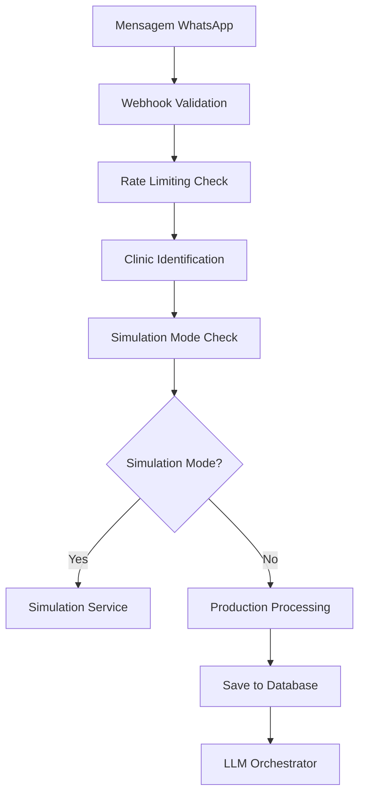

# Lógica de Agendamento via WhatsApp - AtendeAI

## Visão Geral

O sistema de agendamento via WhatsApp do AtendeAI é um chatbot inteligente que utiliza LLM (Large Language Model) para processar mensagens de pacientes e gerenciar agendamentos de forma conversacional e automatizada.

## Arquitetura do Sistema

### 1. Fluxo Principal de Processamento

O sistema segue uma arquitetura em camadas:

1. **Webhook WhatsApp** → Recebe mensagens do Meta WhatsApp Business API
2. **LLM Orchestrator** → Processa e detecta intenções
3. **Appointment Flow Manager** → Gerencia o fluxo de agendamento
4. **Google Calendar Service** → Integração com calendários reais
5. **Response Handler** → Envia respostas formatadas

### 2. Componentes Principais

#### 2.1 Webhook Final (`routes/webhook-final.js`)
- **Função**: Ponto de entrada para mensagens do WhatsApp
- **Responsabilidades**:
  - Validação e autenticação de webhooks
  - Rate limiting para prevenir spam
  - Normalização de números de telefone
  - Verificação de modo simulação vs produção
  - Persistência de conversas no banco de dados

#### 2.2 LLM Orchestrator Service (`services/core/llmOrchestratorService.js`)
- **Função**: Orquestração inteligente do processamento de mensagens
- **Responsabilidades**:
  - Detecção de intenções usando OpenAI GPT-4o-mini
  - Gerenciamento de contexto e memória conversacional
  - Roteamento para ferramentas específicas (agendamento, informações, etc.)
  - Fallback para processamento normal com LLM

#### 2.3 Appointment Flow Manager (`services/core/appointmentFlowManager.js`)
- **Função**: Gerenciador completo do fluxo de agendamento
- **Responsabilidades**:
  - Controle de estado do fluxo conversacional
  - Integração com Google Calendar
  - Extração de serviços do contexto da clínica
  - Validação e confirmação de agendamentos

## Fluxo Detalhado de Agendamento

### Etapa 1: Recepção e Processamento Inicial



### Etapa 2: Detecção de Intenção

O **LLM Orchestrator** utiliza um prompt estruturado para detectar intenções:

- **APPOINTMENT_CREATE**: Usuário quer agendar
- **APPOINTMENT_RESCHEDULE**: Remarcação
- **APPOINTMENT_CANCEL**: Cancelamento
- **INFO_SERVICES**: Informações sobre serviços
- **HUMAN_HANDOFF**: Escalação para humano

### Etapa 3: Fluxo de Agendamento (Estados)

O **Appointment Flow Manager** gerencia 4 estados principais:

#### Estado 1: `initial`
- **Objetivo**: Iniciar o processo de agendamento
- **Ações**:
  - Extrair serviços disponíveis do contexto da clínica
  - Aplicar priorização baseada em políticas (urgência, retorno, etc.)
  - Exibir lista de serviços com emojis e informações
- **Saída**: Lista numerada de até 5 serviços principais

```text
Exemplo de resposta:
"Ótimo, João! Vou te ajudar a agendar sua consulta na Clínica XYZ. 😊

Para isso, preciso saber que tipo de consulta você precisa:

1️⃣ 👨‍⚕️ **Consulta Cardiológica** (30min) - R$ 150,00
2️⃣ 🔬 **Exame de Sangue** (60min) - R$ 80,00
3️⃣ 🩺 **Checkup Geral** (45min) - R$ 200,00

Me diga o **número** da consulta ou escreva o **nome** do serviço!"
```

#### Estado 2: `service_selection`
- **Objetivo**: Processar seleção do serviço
- **Ações**:
  - Analisar entrada do usuário (número ou texto)
  - Validar serviço selecionado
  - Buscar horários disponíveis no Google Calendar
- **Fallbacks**: Até 3 tentativas antes de escalar para humano

#### Estado 3: `date_time_selection`
- **Objetivo**: Apresentar e processar seleção de horários
- **Ações**:
  - Integração real com Google Calendar API
  - Aplicar regras de negócio (antecedência mínima, horários de funcionamento)
  - Mostrar até 4 opções de horários
- **Saída**: Lista de horários disponíveis formatados

```text
Exemplo de resposta:
"Perfeito! Encontrei estes horários disponíveis para Consulta Cardiológica:

1️⃣ 📅 **Segunda, 25/03** às **14:00**
2️⃣ 📅 **Terça, 26/03** às **09:30**
3️⃣ 📅 **Quarta, 27/03** às **16:15**
4️⃣ 📅 **Quinta, 28/03** às **10:45**

Me diga o **número** do horário que funciona melhor para você!"
```

#### Estado 4: `confirmation`
- **Objetivo**: Confirmar e criar o agendamento
- **Ações**:
  - Criar evento no Google Calendar
  - Validar disponibilidade final
  - Persistir agendamento no banco
  - Enviar confirmação formatada

### Etapa 4: Integração com Google Calendar

#### Busca de Horários Disponíveis
```javascript
// Exemplo simplificado do processo
async getAvailableSlots(clinicContext, selectedService) {
  // 1. Verificar configuração do Google Calendar
  if (!clinicContext.googleCalendar?.enabled) {
    throw new Error('Google Calendar não configurado');
  }

  // 2. Buscar slots reais no Google Calendar
  const slots = await this.googleCalendar.getAvailableSlots(
    clinicContext.id,
    clinicContext,
    selectedService,
    14 // 14 dias à frente
  );

  // 3. Aplicar regras de negócio
  return slots.slice(0, 4); // Máximo 4 opções
}
```

#### Regras de Negócio Aplicadas
- **Antecedência mínima**: 24 horas (configurável)
- **Janela de agendamento**: 14 dias à frente
- **Horários de funcionamento**: Baseado no contexto da clínica
- **Duração do serviço**: Extraída do JSON de contextualização

## Tratamento de Erros e Fallbacks

### 1. Escalação para Humano
Ocorre quando:
- 3 tentativas falhas em qualquer etapa
- Google Calendar não configurado
- Nenhum horário disponível
- Erro crítico no processamento

### 2. Recuperação de Estado
- Estados são persistidos no `FlowStateStore`
- Cache local para performance
- Continuação automática de fluxos interrompidos

### 3. Métricas e Monitoramento
- Rastreamento por clínica
- Logs estruturados com trace IDs
- Métricas de sucesso/falha por etapa

## Personalização por Clínica

### Contextualização Dinâmica
Cada clínica possui um JSON de contextualização contendo:

```json
{
  "name": "Clínica XYZ",
  "servicesDetails": {
    "consultas": [
      {
        "nome": "Consulta Cardiológica",
        "duracao": 30,
        "preco_particular": 150.00,
        "categoria": "cardiologia"
      }
    ],
    "exames": [...],
    "procedimentos": [...]
  },
  "policies": {
    "appointment": {
      "prioritization": ["urgencia", "retorno", "exame"]
    }
  },
  "businessHours": {
    "monday": { "start": "08:00", "end": "18:00" },
    "tuesday": { "start": "08:00", "end": "18:00" }
  }
}
```

### Priorização Inteligente (RF08)
Os serviços são ordenados conforme políticas da clínica:
1. **Urgência** - Atendimentos emergenciais
2. **Retorno** - Consultas de retorno
3. **Exames** - Exames diagnósticos
4. **Consultas gerais** - Ordem alfabética

## Recursos Avançados

### 1. Humanização de Respostas
- **Emojis contextuais**: 👨‍⚕️ para consultas, 🔬 para exames
- **Formatação rica**: Negrito, itálico para destaque
- **Tom conversacional**: Personalizado com nome do paciente

### 2. Memória Conversacional
- **Perfil do usuário**: Nome, histórico de conversas
- **Contexto da sessão**: Mantido durante todo o fluxo
- **Preferências**: Horários, tipos de consulta

### 3. Validação e Normalização
- **Números de telefone**: Normalização automática (+55)
- **Identificação de clínica**: Por número WhatsApp
- **Mensagens duplicadas**: Prevenção via IDs únicos

## Configuração e Dependências

### Variáveis de Ambiente Necessárias
```env
OPENAI_API_KEY=sk-...
GOOGLE_CALENDAR_CREDENTIALS=...
WEBHOOK_VERIFY_TOKEN=atendeai-lify-backend
WHATSAPP_ACCESS_TOKEN=...
```

### Integrações Externas
1. **Meta WhatsApp Business API** - Recepção/envio de mensagens
2. **OpenAI GPT-4o-mini** - Processamento de linguagem natural
3. **Google Calendar API** - Gerenciamento de agendamentos
4. **Supabase** - Persistência de dados

## Limitações e Considerações

### Performance
- **Rate limiting**: 100 requisições/minuto por IP
- **Cache de estados**: Reduz latência de continuação
- **Processamento assíncrono**: Não bloqueia webhook

### Escalabilidade
- **Stateless design**: Estados persistidos externamente
- **Horizontal scaling**: Múltiplas instâncias suportadas
- **Isolamento por clínica**: Processamento independente

### Conformidade LGPD
- **Logs auditáveis**: Rastreamento de dados pessoais
- **Retenção de dados**: Políticas configuráveis
- **Anonimização**: IPs ofuscados em logs

## Monitoramento e Métricas

### Logs Estruturados
```json
{
  "traceId": "uuid-4",
  "operation": "appointment_creation",
  "component": "appointment_flow",
  "clinic_id": "123",
  "step": "service_selection",
  "success": true,
  "duration_ms": 150
}
```

### Métricas por Clínica
- Taxa de conversão por etapa
- Tempo médio de agendamento
- Causas de escalação para humano
- Uso de serviços por tipo

---

Este documento reflete a implementação atual do sistema de agendamento via WhatsApp, evidenciando a sofisticação e robustez da solução desenvolvida para o AtendeAI.
